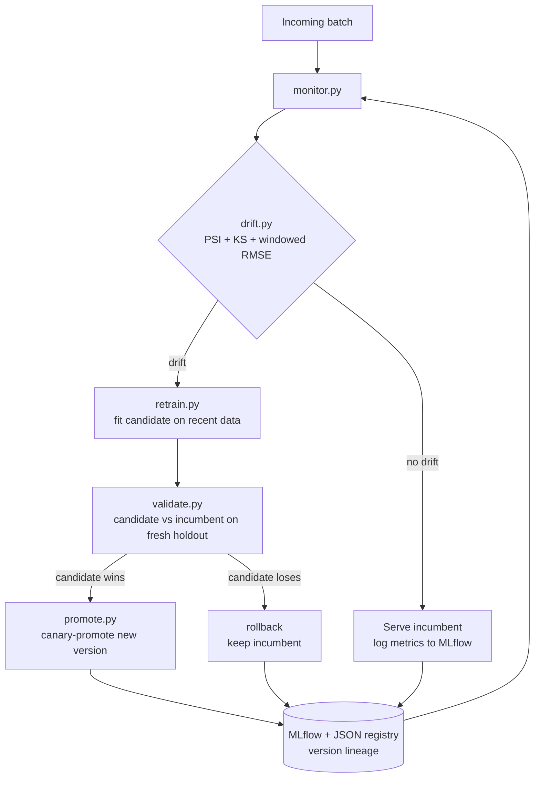

# 🛡️ DriftGuard — Self-Healing MLOps Platform

> A deployed model that keeps *itself* healthy: it detects drift, retrains, validates the candidate against the incumbent, and canary-promotes only if it wins — otherwise it rolls back. No human in the loop.

<p align="center">
  <a href="https://maxmilliamokafor.github.io/driftguard/"><b>🔴 LIVE DEMO</b></a>
  &nbsp;·&nbsp;
  <a href="#-results-measured">Results</a>
  &nbsp;·&nbsp;
  <a href="#-architecture">Architecture</a>
  &nbsp;·&nbsp;
  <a href="#-the-closed-loop">The loop</a>
</p>

<p align="center">
  
  
  
  
</p>

<p align="center">
  <!-- Record a 10–15s GIF: press "Inject drift & run" and watch RMSE spike then self-heal. Save to docs/demo.gif -->
  
</p>

---

## What it does

DriftGuard wraps a deployed regression model (demand forecasting) and watches a
live stream for two kinds of drift:

- **Data drift** — the input distribution shifts (per-feature PSI + KS test).
- **Concept drift** — the input→output mapping changes, so accuracy decays
  (windowed RMSE vs. a baseline tolerance).

When drift crosses a threshold it **automatically** retrains on recent data,
validates the candidate against the incumbent on a fresh holdout, and
**canary-promotes only if the candidate wins** — otherwise it keeps (rolls back
to) the incumbent. Every model version and decision is tracked in MLflow.

The dashboard has a **💥 Inject drift** chaos button so a viewer can watch the
RMSE spike and then self-heal in real time.

## 📊 Results (measured)

From a clean deterministic run (`python -m driftguard.monitor`), drift injected
at step 10:

| Metric | Value |
| --- | --- |
| Baseline RMSE (healthy) | 1.218 |
| Incumbent RMSE at drift (broken) | **6.381** |
| Drift-detection lead time | **0 steps** (caught the moment it hit) |
| Auto-recovery time | **0 steps** (recovered on the same cycle) |
| RMSE after recovery | 1.384 |
| **Performance retained** | **88%** of baseline |
| Model versions created | 3 |
| **Human interventions** | **0** |

The event log also shows a later step where drift was *suspected* but the
retrained candidate did **not** beat the incumbent (improvement −5%), so
DriftGuard **rolled back** and kept the good model — the rollback path working
as designed, not just the promote path.

> Numbers are reproducible: the stream is seeded, so `python -m driftguard.monitor`
> reproduces these on any machine. Tune the scenario via env vars (see `.env.example`).

## 🔁 The closed loop



## 🏗 Architecture

- **`data/stream.py`** — seeded synthetic demand stream; concept drifts at a
  configurable step and stays drifted (deterministic, reproducible demo).
- **`driftguard/drift.py`** — PSI, KS two-sample test, and a windowed
  performance monitor; pure functions, fully unit-tested.
- **`driftguard/retrain.py` / `validate.py` / `promote.py`** — the heal steps.
- **`driftguard/registry.py`** — versioned model registry (joblib artifacts +
  JSON pointer) with a production stage; MLflow logs metrics & lineage.
- **`driftguard/monitor.py`** — the orchestrating closed loop + event log.
- **`driftguard/serve.py`** — FastAPI `/predict`, `/health`, `/lineage`.
- **`dashboard/streamlit_app.py`** — chaos button, RMSE timeline, event log,
  healing decisions, model lineage.

## 🚀 Quickstart

```bash
docker compose up                 # loop + API + dashboard in one command
# API       -> http://localhost:8000/docs
# Dashboard -> http://localhost:8501

# or locally
pip install -r requirements-dev.txt
python -m driftguard.monitor                 # run the self-healing loop
streamlit run dashboard/streamlit_app.py     # dashboard
uvicorn driftguard.serve:app --reload        # serving API
pytest                                       # tests
```

## 🧠 Design decisions & trade-offs

- **Decisions run on deterministic statistics, not a black box.** PSI + KS +
  windowed RMSE are cheap, explainable, and unit-testable, so the *automation*
  never depends on a heavyweight library. Evidently is wired in as an *optional*
  add-on for rich human-facing HTML reports — nice to have, not load-bearing.
- **Promote only on a measured win.** A candidate must beat the incumbent by ≥5%
  on a holdout from the *current* distribution before it ships. This is what
  makes "self-healing" safe rather than reckless — a bad retrain can't degrade
  production, it gets rolled back.
- **Lightweight registry + MLflow tracking.** MLflow's file store can't host the
  full Model Registry (needs a DB), so versioning/promotion live in a small JSON
  registry while MLflow captures metrics and lineage. Result: zero external
  services for the demo, real experiment tracking retained.
- **Recovery measured against achievable performance.** The post-drift concept is
  intrinsically a touch harder, so "recovered" means RMSE back within tolerance
  of baseline (88% retained here), not a fantasy 100% — an honest bar.
- **Seeded synthetic stream over a flaky public feed.** Reproducibility beats
  realism for a demo whose whole point is *watching* the heal happen the same way
  every time. Swapping in a real drifting dataset is a `stream.py` change.

## 🧪 Tests & CI

`pytest` covers drift math (PSI/KS), the promote/rollback decision, and a full
end-to-end loop assertion (detects, recovers, zero interventions, >70% retained).
GitHub Actions runs ruff + black + pytest + a self-heal smoke run on every push.

## 🔗 Live demo (GitHub Pages)

A self-contained demo lives in [`docs/index.html`](docs/index.html) and is served
free via GitHub Pages at **https://maxmilliamokafor.github.io/driftguard/** — the link
to put on a CV. It runs in the browser with no backend.

**Enable it once:** either the included workflow `.github/workflows/pages.yml`
deploys it automatically on push (repo *Settings → Pages → Source: GitHub Actions*),
or set *Settings → Pages → Source: Deploy from a branch → `main` / `/docs`*.

## 📜 License

MIT © 2026 Maxmilliam Okafor
